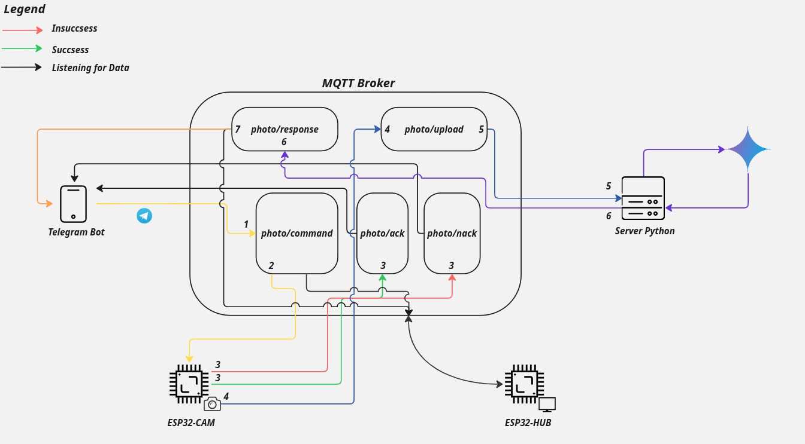

# MQTTImageRecognition
# MQTTImageRecognition

A personal project that combines MQTT messaging protocol with image recognition capabilities to create an IoT-based computer vision system.

## 🎯 Use Case

This project enables real-time image analysis through MQTT communication, making it ideal for:

- **Security Monitoring**: Identify intruders or suspicious activities and send alerts via MQTT
- **IoT Edge Computing**: Process images locally and communicate results through lightweight MQTT messages
- **Pet/Wildlife Monitoring**: Detect and classify animals or pets in camera feeds

The system can receive images via MQTT topics, perform image recognition using LLM, and publish the results back to MQTT topics for consumption by other IoT devices or services.

## 🛠️ Technologies Used

- **MQTT Protocol**: Lightweight messaging protocol for IoT communication
- **Python**: Primary development language (assumed based on common patterns)
- **Paho MQTT**: Python MQTT client library

## 🚧 Architecture




## 🚀 Getting Started

### Prerequisites

- Python 3.8+
- MQTT Broker (e.g., Mosquitto, HiveMQ, or cloud-based broker)
- Camera or image source (ESP32-CAM Module)
- Required Python packages (see requirements.txt)

### Installation

1. **Clone the repository**
   ```bash
   git clone https://github.com/frabru99/MQTTImageRecognition.git
   cd MQTTImageRecognition
   ```

2. **Install dependencies**
   ```bash
   cd TelegramBot
   python -m venv venv
   pip install -r requirements.txt
   ```
   Do the same with ServerPython folder. 

   For arduino code, make sure to install all the required libraries.

3. **Configure MQTT broker**
   - Update MQTT broker configuration in the config file, in order to allow remote connections.

4. **Create a Telegram Bot Key**
   - Create a telegram bot with @BotFather and add the Key in a .env file in TelegramBot folder.

5. **Setup Gemini Key for ServerPython**:
   - Generate an API Key into Gemini web page and put it in a .env file in ServerPython folder.

6. **Setup variables (IP, port and WiFi credentials) for .ino scripts**

### Basic Usage

1. **Start the MQTT Broker on your PC**
	

2. **Start the Server and the Telegram Bot**
   ```bash
   cd MQTTImageRecognizer/TelegramBot
   python bot.py
   ```
   Do the same for the server.py file.

3. **Flash the ESP32-CAM and ESP32-HUB (ESP with an LCD Screen)**
   
4. **Require a photo from Telegram Bot and wait for the results!**
   

## ⚠️ Personal Project Disclaimer

**This is a personal project** developed for learning and experimentation purposes. Please note:

### Current Limitations
- Limited error handling and edge case management
- Basic documentation and code comments
- Minimal testing coverage
- Configuration may require manual adjustments for different environments

### Future Work Needed
- [ ] Comprehensive error handling
- [ ] Unit tests 
- [ ] Web interface for monitoring and configuration
- [ ] Performance optimization and resource management
- [ ] Detailed API documentation
- [ ] Security enhancements (encryption, authentication)
- [ ] Scalability improvements for high-throughput scenarios


## 🤝 Contributing

1. Fork the repository
2. Create a feature branch (`git checkout -b feature/amazing-feature`)
3. Commit your changes (`git commit -m 'Add some amazing feature'`)
4. Push to the branch (`git push origin feature/amazing-feature`)
5. Open a Pull Request

## 📞 Contact

For questions, suggestions, or collaboration opportunities, feel free to reach out through GitHub issues or contact the repository owner.

---

*This README will be updated as the project evolves and new features are implemented.*
